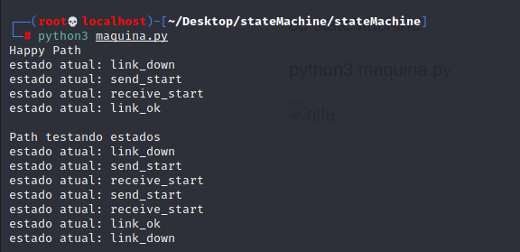

# Projeto de Máquina de Estados em python

Baseado no pdf 'Teste de conhecimentos em programação Linux'

### Como rodar:

git clone https://github.com/franzkurt/stateMachine.git

cd stateMachine

python3 maquina.py  

